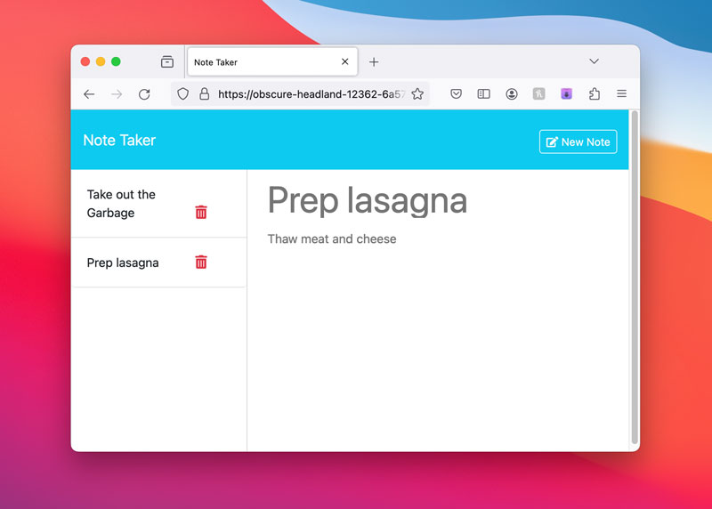

# Note Taker

## The Project

Note Taker is a simple app that enables users to add new notes, view existing notes, and delete notes, while storing them in a DB file. Using Express, I setup backend routing for GET, POST, and DELETE requests. The app also generates a unique note ID when posting a new note, so that the GET and DELETE requests can reference an ID.

This app is deployed to Heroku: [Note Taker](https://obscure-headland-12362-6a57dc48ca39.herokuapp.com).

